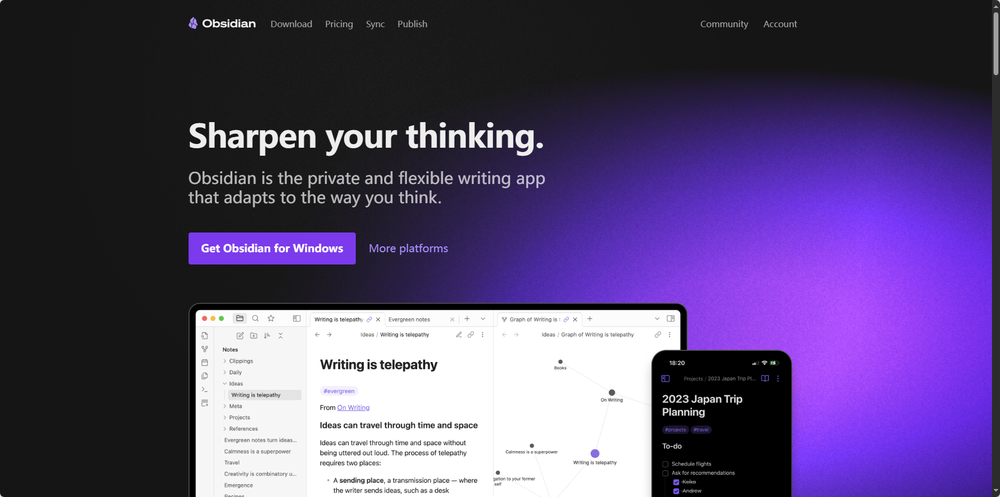

请使用Obsidian打开本知识库：
- 自动渲染文章
- 自动建立起附件索引
- 自动集成我的Obsidian插件

Obsidian知识库渲染效果展示：

Java武林絕學盡藏於本知識庫📚：git clone https://github.com/lyflexi/obsidianNotes.git
- 集合
- 注解
- 反射
- 多线程并发编程
- 设计模式
- 设计原则
- 新特性
- Spring、SpringMVC、SpringBoot
- MySql
- 缓存Redis
- 消息队列MQ
- Nginx
- SpringCloud
- 分布式解决方案
- Linux、Docker、K8S
- ...

>Reference：[Markdown 官方教程](https://markdown.com.cn/)

